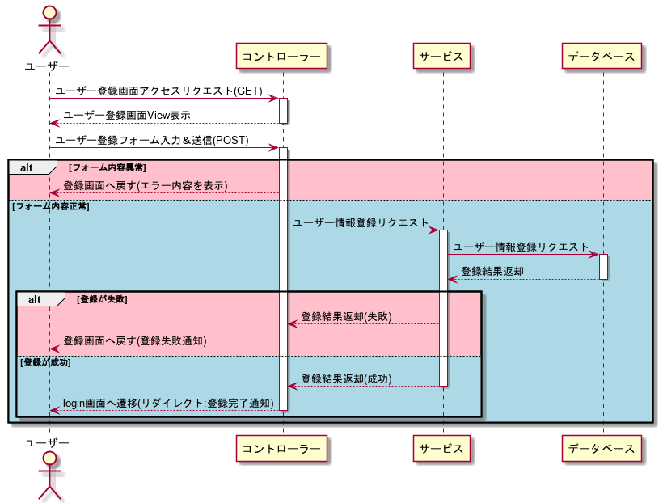
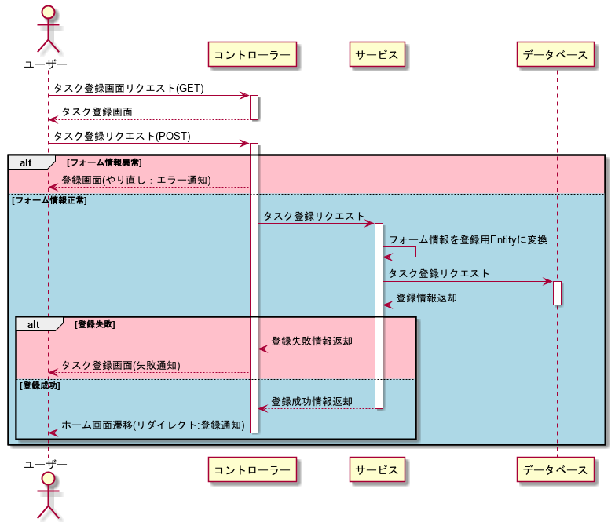
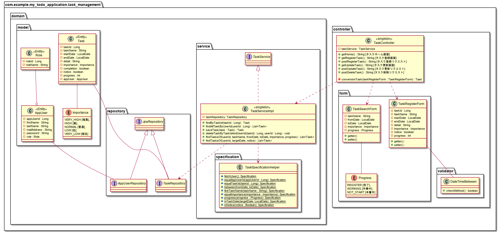

# マイTODOアプリケーションとは？
タスク管理アプリケーション

# アプリケーションURL
未実装

## 使用技術
### フレームワーク・言語
* Spring Boot
  * JPA ・Thymeleaf ・AOP ・ SpringSecurity
* Java
* HTML5
* CSS(Sass)
* JavaScript

### データベース
* PostgreSQL

### インフラ
* AWS(予定)

## 利用方法
※ 未実装

## 作成した理由・背景
主に勉強の過程として
  
今までは開発前に、ノートに機能要件・データベース設計・要件ごとに機能の洗い出しと言った事を何となく
行ったうえで開発に落とし込んでいた。

しかし、より実践的に開発してみたいという思いと、開発前にしっかりとした基本設計・詳細設計や(主に詳細設計)、
図の作成(ユースケース図・シーケンス図・クラス図・ER図)等をしたうえで
落とし込んでいくことは重要な事だという思いが強くなり、実践してみようと思ったことがきっかけです。

## アプリケーション機能(設計)

機能名 機能概要 機能分類 実装方法

### 要件の洗い出し
<table>
  <tr>
    <th>機能名</th>
    <th>機能概要</th>
    <th>機能分類</th>
    <th>実装方法</th>
  </tr>
  <tr>
    <td>アカウント登録</td>
    <td>ユーザーが新規アカウントを登録する</td>
    <td>画面</td>
    <td>新規登録フォームから新規アカウントを作成する(メールアドレス・パスワード等)</td>
  </tr>
  <tr>
    <td>ログイン機能</td>
    <td>ユーザーがWebページにログインする</td>
    <td>画面</td>
    <td>ログインフォームからID及びパスワードを入力してログインする</td>
  </tr>
  <tr>
    <td>タスク登録機能</td>
    <td>ユーザーが新たなタスクを登録する</td>
    <td>画面</td>
    <td>タスク登録フォームから新たなタスクを登録する</td>
  </tr>
  <tr>
    <td>タスク更新機能</td>
    <td>ユーザーが登録されているタスクの更新を行う</td>
    <td>画面</td>
    <td>タスク変更フォームから既に登録されているタスクの内容を更新する</td>
  </tr>
  <tr>
    <td>タスク削除機能</td>
    <td>ユーザーが登録されているタスクの削除を行う</td>
    <td>画面</td>
    <td>タスク削除フォームから既に登録されているタスクの内容を削除する</td>
  </tr>
  <tr>
    <td>タスク閲覧機能</td>
    <td>ユーザーが登録されているタスクの閲覧を行う</td>
    <td>画面</td>
    <td>タスク閲覧画面への遷移を行う</td>
  </tr>
  <tr>
    <td>タスク出力機能</td>
    <td>ユーザーが選択したタスク情報を元にExcel・CSV・PDF形式等での出力を行う</td>
    <td>画面</td>
    <td>タスク出力フォームから出力情報を入力しその内容を元に出力処理</td>
  </tr>
  <tr>
    <td>タスク注意勧告機能</td>
    <td>ユーザーが登録したタスク期間中の完了してないタスクの注意勧告を行う</td>
    <td>画面</td>
    <td>データベースから特定のタスクを抽出し、画面に出力する</td>
  </tr>
  
</table>

### 各種画面

<table>
  <tr>
    <th>画面名</th>
    <th>詳細</th>
  </tr>
  <tr>
    <td>ログイン画面</td>
    <td>ログインの画面</td>
  </tr>
  <tr>
    <td>ユーザー登録画面</td>
    <td>ユーザーが新規登録する際の画面</td>
  </tr>
  <tr>
    <td>ホーム画面</td>
    <td>
      アプリケーションのホーム画面
       
      タスクの詳細画面
       
      タスク検索画面
    </td>
  </tr>
  <tr>
    <td>タスク登録画面</td>
    <td>タスクを新規に登録及び更新する画面</td>
  </tr>
</table>

### データベースのテーブル一覧

<table>
  <tr>
    <th>テーブル名</th>
    <th>概要</th>
    <th>関連</th>
  </tr>
  <tr>
    <td>app_user</td>
    <td>ユーザー情報</td>
    <td>role, app_user_task</td>
  </tr>
  <tr>
    <td>role</td>
    <td>ユーザーのロール情報</td>
    <td>app_user</td>
  </tr>
  
  <tr>
    <td>task</td>
    <td>ユーザーのタスク情報</td>
    <td>app_user_task</td>
  </tr>
</table>

## UML・ER

### ER図

### ユースケース図

### シーケンス図

#### ユーザー登録の流れ

### ログイン処理の流れ

### タスク登録処理の流れ

### タスク更新処理の流れ

### タスク削除処理の流れ

### タスク参照処理の流れ

## クラス図

### タスク管理系のクラス図

## その他